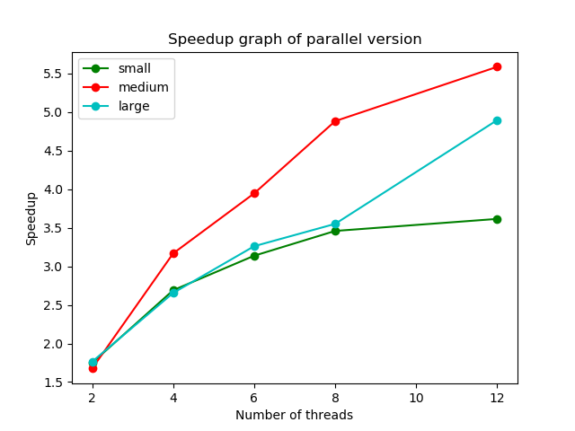
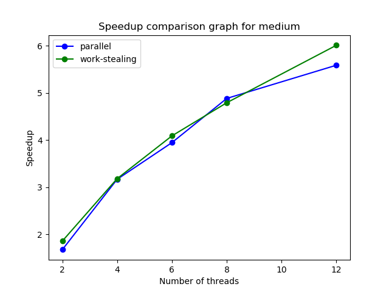

# Monte Carlo Minima Sampling for Polynomial Surfaces

## Introduction

In this project, I have developed a Monte Carlo simulator in Golang1.19 designed to identify the minima on polynomial surfaces up to degree 3 in both the x and y dimensions, all within a specified range. The recognition of these minima is crucial in various fields, such as optimization, physics, and machine learning.

The Monte Carlo simulation approach proves advantageous in handling complex, high-dimensional function landscapes. Unlike deterministic methods, Monte Carlo methods utilize random sampling, making them particularly suitable for scenarios with uncertain or stochastic elements. The inherent randomness in Monte Carlo facilitates a more comprehensive exploration of the function space, providing robust estimates of minima even in the presence of noise or uncertainty. This stochastic nature enables a more resilient and adaptable approach to solving optimization problems associated with polynomial surfaces.

The primary objective of this project is to implement this code in three distinct manners: a sequential implementation, a straightforward parallel implementation, and a parallel implementation incorporating work-stealing queues. Following the implementations, an analysis will be conducted to evaluate the efficiency and performance of these different approaches.

## Implementation

### Input

The inputs are the polynomial functions to be evaluated and their specified domains. Each one is provided in the form of a JSON object in the following format:

```json
{
  "Cx3": 0.5,
  "Cy3": 0.5,
  "Cx2y": 1.0,
  "Cxy2": 1.0,
  "Cx2": 2.0,
  "Cy2": 2.0,
  "Cxy": 3.0,
  "Cx": 4.0,
  "Cy": 4.0,
  "C": 5.0,
  "Min_x": -10.0,
  "Max_x": 10.0,
  "Min_y": -10.0,
  "Max_y": 10.0
}
```
In this example, this input is modeling the polynomial 
$$ 0.5x^3 + 0.5y^3 + 1.0x^2y + .0xy^2 + 2.0x^2 + 2.0y^2 + 3.0xy + 4.0x + 4.0y + 5.0 $$
in the range $-10.0<x<10.0$ and $-10.0<y<10.0$.

### Simulation

The code operates by dividing the specied range into intervals of $0.1\times 0.1$ and sampling $100$ points within
each interval. For every sampled point, the polynomial values are computed, and the minimum among them
is determined. Three versions of the implementation exist – a sequential version, a parallel version, and a
work-stealing parallel version.

The parallel versions adopt the map-reduce pattern, which is well-suited for this implementation. This
pattern efficiently breaks down the Monte Carlo simulation into independent tasks, enabling concurrent
processing and making the most of available computational resources. It also facilitates load balancing by
naturally lending itself to even distribution of tasks among threads, thereby enhancing overall parallel
performance.

In the map phase, the domain is divided into $0.1\times 0.1$ intervals, forming tasks with the corresponding
polynomial functions. These tasks are then added to a queue. Worker routines dequeue tasks from the
queue and process them. In the reduce phase, each worker routine provides the minimum value of the
function evaluated over its assigned tasks. The main routine collects these values and determines the overall
minimum among them.

#### Task Queue

The task queue is structured as a doubly linked list, offering methods such as PushBottom, PopBottom, and
PopTop. The PushBottom method, utilized by the main routine, is responsible for creating the queue. It
enqueues packaged tasks to the task queue. Conversely, the PopBottom method is employed by individual
goroutines to dequeue tasks from their own task queues for processing. In the case of work-stealing threads,
the PopTop method comes into play. This method attempts to steal tasks from the top of task queues
belonging to other threads once it completes processing its own task queue.

The PopTop method is designed to be thread-safe, allowing it to either succeed or fail based on whether a
PopBottom or another PopTop operation was successful. To avoid the ABA problem, dynamic allocation
for the nodes of the queue is implemented.

#### Sequential Version

The main routine generates tasks, following the previously outlined process, and enqueues them onto a task
queue. Once this task creation is complete, the main routine invokes a function that sequentially dequeues
tasks from the queue, processes them one by one, and returns the minimum value. This iterative process is
repeated for each polynomial function present in the input.

#### Parallel Version

The user provides the number of threads to be created as input. Subsequently, the main routine generates an
equal number of task queues, ensuring fairness in task distribution. The packaged tasks are then assigned to
each queue in an equitable manner. Following this, the main routine initiates worker routines
corresponding to the specified number of threads. Each worker routine is assigned a task queue to process,
and it returns the minimum value obtained from evaluating the tasks within its queue.

To synchronize the completion of all worker routines, the main routine waits using the Wait() method on a
barrier, implemented through a condition variable. Once all coroutines have joined, the main routine
proceeds to the reduce phase to calculate the final answer. This entire process is repeated for each polynomial
function in the input.

#### Work-Stealing Version

This version operates similarly to the parallel variant but introduces a work-stealing mechanism. It takes the
number of threads as input, creating appropriately sized task queues for each worker routine to be spawned.
The key distinction lies in the behavior when a worker routine finishes its own task queue; it attempts to steal work from other routines that might still be active.

The mechanism is implemented through a shared counter variable. Each worker increments this counter after its task queue is exhausted. If the counter is less than the total number of workers, it signifies that other
workers are still processing their queues. The current routine then randomly selects one of the other routines and tries to steal work from it. This process continues until the counter equals the total number of
worker routines spawned.

While the worker routines perform their tasks, the main routine waits using a barrier. Once all worker routines complete their tasks, the main routine proceeds with the reduce phase. This entire process repeats for each polynomial function in the input.

### Output

After completing the computation, the program consolidates the minimum values obtained for all the inputs and stores them in a JSON file.

### Running the Program

To run the program, put the inputs as JSON objects into a JSON file and place it in the proj3/data directory. Then run the following from the terminal from inside the proj3 directory:

```bash
$ go run ./driver/driver.go <input> <mode> <numThreads>
```

where  $\text{<input>}$  is the name of the JSON file in the data subdirectory. The inputs used in the experiment are in the files small.json, medium.json, and large.json in the data subdirectory. To use either of them, the usage is:

```bash
Usage: driver <data_size> <mode> <number of threads>
data_size = (big) functions with big sized domains, (medium) functions with medium
sized domains, (small) functions with small sized domains
mode = (s) run sequentially, (p) run in parallel normally, (w) run in parallel with
work stealing
number of threads = number of threads to spawn in p or w mode (not required for
mode s)
```

The result of the program, which is the minima of the evaluated inputs, will be stored in a
$\text{results\_<input>.json}$ file in the data subdirectory and the output of the program will be the time taken to
execute the program in seconds.

## Experiment

The experiment involves three input files: small.json, medium.json, and large.json. The nomenclature of these files corresponds to the size of the domains on which each of the 10 functions within them are to be evaluated. Consequently, as the domain size increases, the number of packaged tasks generated also increases. For each of the three input files, the experiment runs in one of three modes: sequential (s), parallel (p), or work-stealing parallel (w). The two parallel implementations, denoted as p and w, are executed with the number of threads set to 2, 4, 6, 8, and 12. Each iteration is repeated five times, and the resulting times are averaged over these five runs to provide more reliable data for analysis.

To automate the experiment, the following command is executed from within the proj3 directory:

```bash
$ sbatch ./benchmark/performance-analysis.sh
```

This slurm script runs the benchmark/analysis.py program which executes the experiment. It stores the times in the benchmark/slurm/out/analysis_results.stdout file, and produces relevant plots to be stored as .png files in the benchmark subdirectory.

## Results

The produced plots are given below.







## Discussion and Analysis

#### Challenges and System Aspects

Monte Carlo analysis is an embarrassingly parallel algorithm, so the majority of work can be parallelized.
One signicant hurdle was the non-threadsafe nature of the rand.Rand() function, initially hindering
parallel performance and resulting in a slowdown rather than the expected speedup. Addressing this, a
thread-safe random sampling implementation was adopted to ensure seamless parallelization.

The major hotspots in the program are the random number sampling and function evaluation stages
managed through packaged tasks, contributing to the signicant speedup observed in the graphs presented
above. One bottleneck is observed in the sequential creation of the task queue, which could further be
addressed by a producer-consumer model for concurrent task queue creation to enhance parallelism.
Another bottleneck is the reduce phase, which is more or less unavoidable.

#### Comparison across Data Size
The small input exhibited a speedup of about 3x, primarily attributed to a lack of sufficient workload, where
the time taken for the work was comparatively more than the overhead of spawning new routines. In
contrast, the medium and large input sizes demonstrated substantial speedups of around 5-6x.

#### Comparison of Parallel Implementations

Both parallel implementations, the standard parallel version and the work-stealing version, demonstrated
comparable speedups in the range of 5-6x. The minimal difference observed between the two versions was
primarily a result of the even workload distribution in the standard parallel version, mitigating the impact of
work stealing. However, in most cases, the work-stealing approach either equaled or slightly outperformed
the regular parallel version, with a marginal improvement ranging from 0.1-0.2x as evidenced in the plots
above. This enhancement is because on the machine even equally distributed work has a certain amount of
randomness to the finishing time of the routines. Work stealing helps balance this out and shows
improvement whenever this randomness is more pronounced, providing generally a slight bit a performance
improvement.


